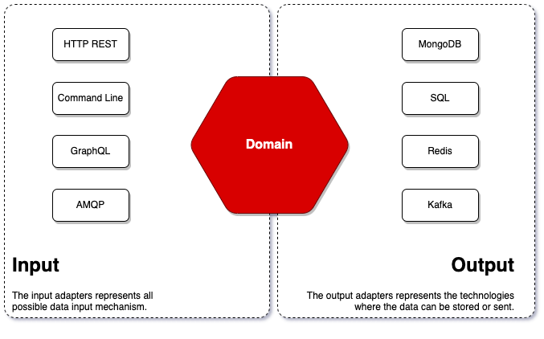
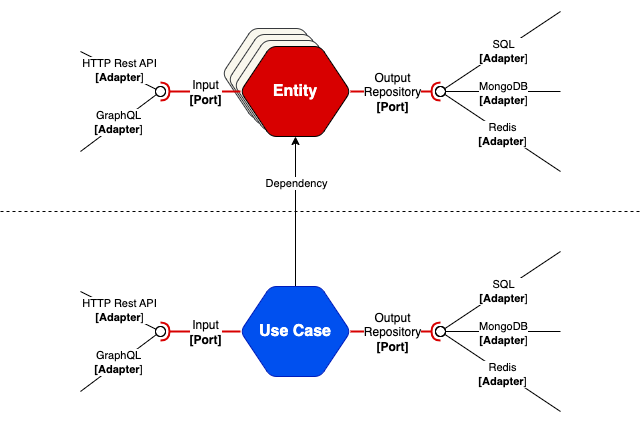

Torpedo generates a clean code based on the Hexagonal Architecture design principle that encourages decoupling of software components in order to increase flexibility and maintainability.
In order to achive that goal concepts like `service`, `repository`, `entity`, `input`, `output` and others begin to play a principal role on the generated code.

The next is a diagram that ilustrates the generated components and their interaction:

The **Domain** of this architecture is composed by the below main components:

 - **Entity:** The entities are defined by the Torpedo Schema.
    - **Controller:** Handles the entity input. 
    - **Service:** The service has the responsibility of handle all the entity business logic. 
    - **Repository:** The repository knows how to "save" the entity data.
 - **Use Case:** The use case defines the custom business logic which is domain wide 

???+ info "Entity object"

    The entity object represents the user defined schema with all methods setters and getters.  

## Data flow

Your application will receive the inbound data from the `input adapters`, like a REST API. This one will have access to call
all the use cases via the `domain.Service` instance or even the entities' service logic. From the service you will have access to interact with the `entity model` and the `repository`.

