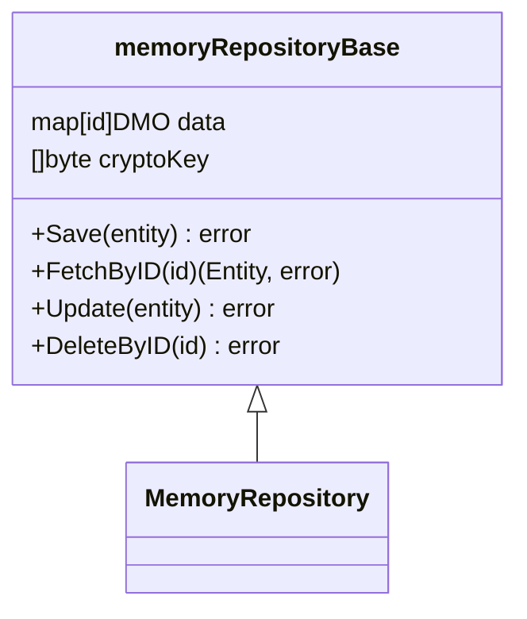

A memory output refers to a type of secondary adapter that handles data storage and retrieval using in-memory structures rather than external databases or file systems. This can be particularly useful for caching, temporary data storage, or scenarios where persistence is not required.

By implementing a memory output as a secondary adapter, Torpedo maintains its principles of decoupling and flexibility, allowing the core application logic to remain independent of the storage mechanism used.

## Spec definition
The spec definition can be set via [$.spec.adapters.output.memory](basic_entity_definition.html#memory). An example of it could be:

???+ abstract "Output adapter Memory sample"
    ```yaml
    adapters:
      output:
        - type: memory
    ```

!!! warning "Torpedo Query Language"
    This adapter doesn't support TQL query

## Memory repository implementation

Torpedo implements a `memory` repository on top of a `key-value` map which is not thread safe. 
All CRUD operations are supported, however Torpedo Query (TQL) operation is not supported.

### Repository

Each Repository Adapter implements the entity port interface named `IRepository` that extends from `IRepositoryBase`. 
So, if you have to add repository methods, please add it on the `IRepository` interface. 

Once torpedo command generates the code the outcome will be:



!!! danger "As developer"

    As a developer your repository methods **MUST BE** written into the MemoryRepository class in order to avoid
    that Torpedo code generation tool overwrite your code!


!!! info "Storage source"

    As a developer the data source can be accessed directly from the `MemoryRepository` due to has an aggregation with `memoryRepositoryBase`.  

### Data Mapper Object (DMO)

DMOs are the selected objects to map your entity data into a secondary adapter or storage adapter. This objects has te capability to
encrypt or decrypt field values at save/update or fetch operations. Because of this a crypto key must be passed as parameter at Repository constructor function.

Each time that a repository is created the encryption key must be provided.

!!! warning "AES key"
    The key argument should be the AES key, either 16, 24, or 32 bytes to select AES-128, AES-192, or AES-256. 

It is possible to add custom fields to this object manually as member of the object named `DMO`.

### Provider

The memory repository can be provided inline as part of the entity provider, the next one is a sample code:

Following the example of the section [Extending Entity with custom fields
](advanced_entity_add_fields.html#lets-following-this-with-an-example) we will need to bind a `memory` repository to the entity service like the example below:

???+ abstract "dependency/sensor.go | SensorProvider"
    ```go hl_lines="6 44"
    package dependency
    
    import (
        "bitbucket.org/darksubmarine/machine/domain/entities/sensor"
        sensorHTTP "bitbucket.org/darksubmarine/machine/domain/entities/sensor/inputs/http/gin"
        sensorRepo "bitbucket.org/darksubmarine/machine/domain/entities/sensor/outputs/memory"
        
        "github.com/darksubmarine/torpedo-lib-go/app"
        "github.com/darksubmarine/torpedo-lib-go/conf"
        "github.com/darksubmarine/torpedo-lib-go/log"
        "github.com/gin-gonic/gin"
    )
    
    type SensorProvider struct {
        app.BaseProvider
    
        // sensor service instance to be provided.
        service sensor.IService `torpedo.di:"provide"`
    
        // sensor repository instance to be provided.
        repo sensor.IRepository `torpedo.di:"provide"`
    
        // logger instance provided by LoggerProvider.
        logger log.ILogger `torpedo.di:"bind"`
    
        // storageKey is the crypto key to encode encrypted fields at storage level.
        storageKey []byte `torpedo.di:"bind,name=STORAGE_KEY"`
    
        // apiV1 group to register endpoints
        apiV1 *gin.RouterGroup `torpedo.di:"bind,name=APIv1"`
        
        // private fields initialized by constructor
        cfg conf.Map
    }
    
    func NewSensorProvider(config conf.Map) *SensorProvider {
        return &SensorProvider{cfg: config}
    }
    
    // Provide provides instances.
    func (p *SensorProvider) Provide(c app.IContainer) error {
    
        // -- Repo (output) ---
        p.repo = sensorRepo.NewMemoryRepository(p.storageKey) //(1)!
        
        // -- Service (business logic)
        p.service = sensor.NewService(p.repo, p.logger)
    
        // -- Controller (input) --
        controller := sensorHTTP.NewInputGin(p.service, p.logger)
        controller.Register(p.apiV1)
    
        return nil
    }
    
    ```

    1. Memory repository is set in line and not needs a driver or different provider.
