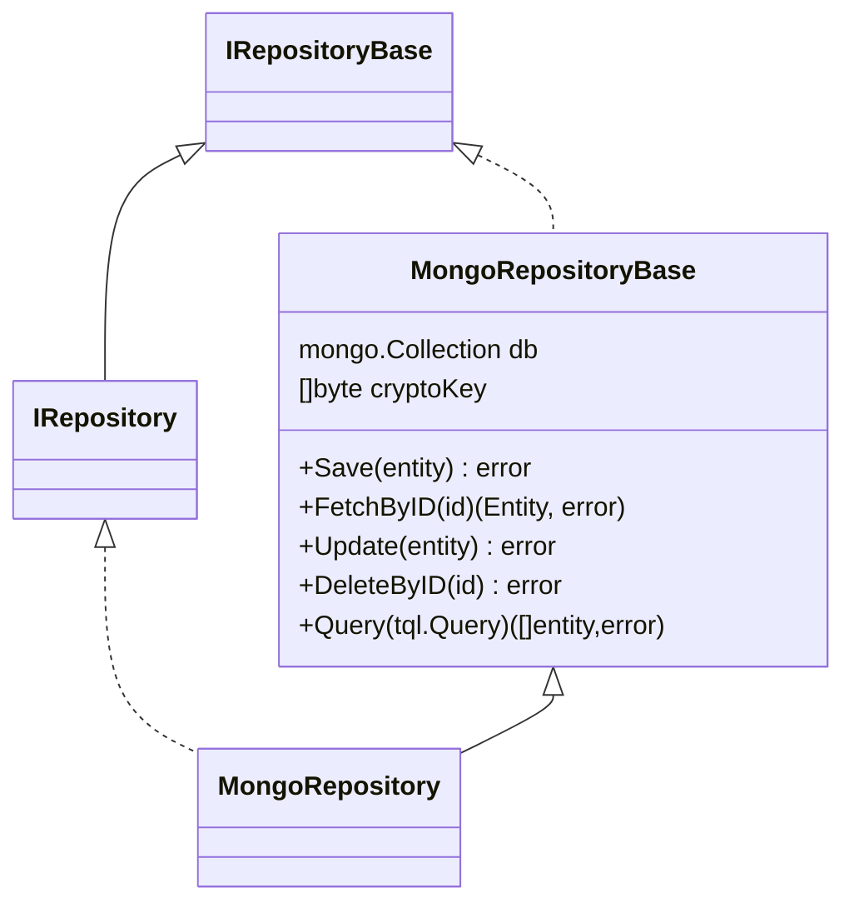

Using MongoDB as an output adapter in a hexagonal architecture involves interacting with a NoSQL database to store and retrieve domain entities. MongoDB, being a document-oriented database, is well-suited for applications requiring flexible, schema-less data storage. The adapter translates domain objects into MongoDB documents and vice versa, ensuring the core application remains independent of MongoDB specifics.

## Role of MongoDB as an Output Adapter

1. **Interfacing with MongoDB**:
    - The adapter manages the interactions with the MongoDB database, performing CRUD operations to store and retrieve data.

2. **Data Translation**:
    - It converts domain objects into MongoDB documents and translates documents back into domain objects.

3. **Decoupling**:
    - It decouples the core application logic from MongoDB-specific implementation details, promoting flexibility and maintainability.

## Benefits of Using MongoDB as an Output Adapter

- **Schema Flexibility**: MongoDB allows for schema-less data storage, making it easy to evolve the data model over time.
- **Scalability**: MongoDB supports horizontal scaling through sharding, enabling it to handle large volumes of data.
- **Rich Document Model**: MongoDB's document model allows for storing complex, nested data structures in a single document.
- **Decoupling**: The core application logic is decoupled from MongoDB-specific details, ensuring that business logic is independent of the data storage mechanism.

Using MongoDB as an output adapter in a hexagonal architecture provides a flexible and scalable solution for data persistence. By implementing the repository pattern, the core application remains agnostic to the specifics of the MongoDB database, promoting decoupling, flexibility, and maintainability. This approach ensures that the application can leverage the strengths of MongoDB while keeping the business logic clean and independent.

## Spec definition
The spec definition can be set via [$.spec.adapters.output.mongodb](basic_entity_definition.html#mongodb). 
An example of it could be:


???+ abstract "Output adapter MongoDB sample"
    ```yaml
        adapters:
          output:
            - type: mongodb
              metadata:
                collection: "posts" #(1)!
    ```

    1. The `collection` attribute let you configure the collection name.

!!! info "Optional metadata"
        The metadata configuration is optional and if it has not been set defaults values will be used by Torpedo.
        For the collection name, the entity name will be used to set it up.

## MongoDB Repository Implementation

The MongoDB repository has been implemented on top of the [Official Go Driver](https://pkg.go.dev/go.mongodb.org/mongo-driver/mongo).
And following the Torpedo Repository pattern, two classes will be created, one of it a base repository with CRUD and Query operations and the other one 
a main Repository where the custom logic must be placed and with access to the instance of `*mongo.Collection` to let developers perform its operations.

The generated code should look like this:




### Data Mapper Object (DMO)

DMOs are the selected objects to map entity data into a secondary adapter or storage adapter.
These objects are responsible to encrypt or decrypt field values at save/update or fetch operations.

Each time that a repository is created the encryption key must be provided.

!!! warning "AES key"
    The key argument should be the AES key, either 16, 24, or 32 bytes to select AES-128, AES-192, or AES-256.


### Provider

The MongoDB repository has been tested with [MongoDB official driver.](https://pkg.go.dev/go.mongodb.org/mongo-driver/mongo)
Each entity needs to create their own repository instance and this happens into the entity `dependency` provider.

Before to `bind` a MongoDB instance as part of your entity provider, a `*mongo.Database` provider must be created.

#### Repository provider

???+ abstract "dependency/mongodb.go | MongoDBProvider"
    ```go
    package dependency
    
    import (
        "context"
        "github.com/darksubmarine/torpedo-lib-go/app"
        "github.com/darksubmarine/torpedo-lib-go/conf"
        "github.com/darksubmarine/torpedo-lib-go/log"
        "go.mongodb.org/mongo-driver/mongo"
        "go.mongodb.org/mongo-driver/mongo/options"
        "go.mongodb.org/mongo-driver/mongo/readpref"
        "time"
    )
    
    type MongoDBProvider struct {
        app.BaseProvider
    
        // singleton instance
        db *mongo.Database `torpedo.di:"provide"`
    
        // logger instance to be provided
        logger log.ILogger `torpedo.di:"bind"`
    
        // private fields initialized by constructor
        cfg conf.Map
    }
    
    func NewMongoDBProvider(config conf.Map) *MongoDBProvider {
        return &MongoDBProvider{cfg: config}
    }
    
    // Provide provides the logger instance.
    func (p *MongoDBProvider) Provide(c app.IContainer) error {
    
        username := p.cfg.FetchStringOrElse("root", "db", "username")
        password := p.cfg.FetchStringOrElse("example", "db", "password")
        host := p.cfg.FetchStringOrElse("mongodb://localhost:27017", "db", "host")
        dbName := p.cfg.FetchStringOrElse("torpedo", "db", "database")
    
        // creating mongo.client instance as singleton.
        p.db = p.mongoClient(username, password, host).Database(dbName)
    
        return nil
    }
    
    func (p *MongoDBProvider) OnStop() func() error {
        return func() error {
            return p.db.Client().Disconnect(context.Background())
        }
    }
    
    func (p *MongoDBProvider) mongoClient(username, password, host string) *mongo.Client {
        ctx, cancel := context.WithTimeout(context.Background(), 10*time.Second)
        defer cancel()
    
        credentials := options.Credential{Username: username, Password: password,
            AuthSource: "admin", AuthMechanism: "SCRAM-SHA-256"}
    
        client, err := mongo.Connect(ctx, options.Client().ApplyURI(host).SetAuth(credentials))
    
        ctx, cancel = context.WithTimeout(context.Background(), 2*time.Second)
        defer cancel()
    
        err = client.Ping(ctx, readpref.Primary())
        if err != nil {
            panic(err)
        }
    
        return client
    }
    ```

#### Entity provider

Following the example of the section [Extending Entity with custom fields
](advanced_entity_add_fields.html#lets-following-this-with-an-example) we will need to bind a `mongodb` repository to the entity service like the example below:

???+ abstract "dependency/sensor.go | SensorProvider"
    ```go
    package dependency
    
    import (
        "bitbucket.org/darksubmarine/machine/domain/entities/sensor"
        sensorHTTP "bitbucket.org/darksubmarine/machine/domain/entities/sensor/inputs/http/gin"
        sensorRepoMongoDB "bitbucket.org/darksubmarine/machine/domain/entities/sensor/outputs/mongodb"
        "github.com/darksubmarine/torpedo-lib-go/app"
        "github.com/darksubmarine/torpedo-lib-go/conf"
        "github.com/darksubmarine/torpedo-lib-go/log"
        "github.com/gin-gonic/gin"
        "go.mongodb.org/mongo-driver/mongo"
    )
    
    type SensorProvider struct {
        app.BaseProvider
    
        // sensor service instance to be provided.
        service sensor.IService `torpedo.di:"provide"`
    
        // sensor repository instance to be provided.
        repo sensor.IRepository `torpedo.di:"provide"`
    
        // logger instance provided by LoggerProvider.
        logger log.ILogger `torpedo.di:"bind"`
    
        // storageKey is the crypto key to encode encrypted fields at storage level.
        storageKey []byte `torpedo.di:"bind,name=STORAGE_KEY"`
    
        // apiV1 group to register endpoints
        apiV1 *gin.RouterGroup `torpedo.di:"bind,name=APIv1"`
    
        // mongodb singleton instance
        db *mongo.Database `torpedo.di:"bind"` //(1)!
    
        // private fields initialized by constructor
        cfg conf.Map
    }
    
    func NewSensorProvider(config conf.Map) *SensorProvider {
        return &SensorProvider{cfg: config}
    }
    
    // Provide provides instances.
    func (p *SensorProvider) Provide(c app.IContainer) error {
    
        // -- Repo (output) ---
        p.repo = sensorRepoMongoDB.NewMongoDBRepository(p.db.Collection(sensorRepoMongoDB.CollectionName), p.storageKey)

        // -- Service (business logic)
        p.service = sensor.NewService(p.repo, p.logger)
    
        // -- Controller (input) --
        controller := sensorHTTP.NewInputGin(p.service, p.logger)
        controller.Register(p.apiV1)
    
        return nil
    }
    ```
    
    1. The mongoDB instance is bound to the default instance provided by [MongoDBProvider](#repository-provider)

