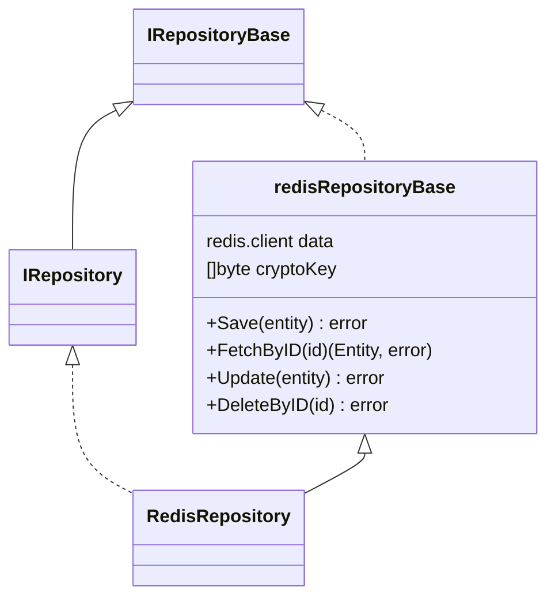

Using Redis as an output adapter in a hexagonal architecture means that Redis will handle data storage and retrieval for your application's domain entities. Redis, being an in-memory data structure store, is ideal for use cases requiring fast read and write operations, such as caching, session storage, and real-time analytics.

## Role of Redis as an Output Adapter

1. **Interfacing with Redis**:
    - The adapter manages interactions with the Redis data store, including setting and getting data.

2. **Data Translation**:
    - It translates domain objects into data models suitable for Redis storage and vice versa.

3. **Decoupling**:
    - It decouples the core application logic from Redis-specific implementation details, ensuring flexibility and maintainability.

## Benefits of Using Redis as an Output Adapter

- **Speed**: Redis provides very fast read and write operations due to its in-memory nature, making it ideal for applications requiring high performance.
- **Flexibility**: Redis supports various data structures (strings, hashes, lists, sets, etc.), allowing for flexible storage solutions.
- **Scalability**: Redis can handle a large number of operations and can be scaled horizontally by using sharding or clustering.
- **Decoupling**: The core application remains decoupled from Redis-specific details, ensuring flexibility and maintainability.

## Spec definition
The spec definition can be set via [$.spec.adapters.output.redis](basic_entity_definition.html#redis). An example of it could be:

???+ abstract "Output adapter Redis sample"
    ```yaml
      adapters:
        output:
          - type: redis
            metadata:
              ttl: 30000 #(1)!
    ```

    1. The `ttl` attribute let you configure the entity object Time To Live value into Redis cache. This is set in `milliseconds`.


!!! info "Optional metadata"
    The metadata configuration is optional and if it has not been set defaults values will be used by Torpedo. For the TTL the default value is zero which means that object live forever or till a delete operation happens.

!!! warning "Torpedo Query Language"
    This adapter doesn't support TQL query

## Redis Repository Implementation

The Redis repository has been implemented on top of the library [github.com/go-redis/redis](https://github.com/go-redis/redis).

This adapter will provide 2 repository classes that implements the output repository port interface and would look like:





!!! info "Redis client"

    As a developer the Redis client can be accessed directly from the `RedisRepository` due to has an aggregation with `redisRepositoryBase`.  


### Data Mapper Object (DMO)

DMOs are the selected objects to map entity data into a secondary adapter or storage adapter. 
This objects are responsible to encrypt or decrypt field values at save/update or fetch operations. 
Each time that a repository is created the encryption key must be provided.

!!! warning "AES key"
    The key argument should be the AES key, either 16, 24, or 32 bytes to select AES-128, AES-192, or AES-256.


### Provider

The Redis repository has been tested with [Go Redis lib](https://github.com/go-redis/redis)
Each entity needs to create their own repository instance and this happens into the entity `dependency` provider.

Before to `bind` a Redis instance as part of your entity provider, a `*redis.Client` provider must be created.

#### Repository provider

???+ abstract "dependency/redis.go | RedisProvider"
    ```go
    package dependency
    
    import (
        "context"
        "fmt"
        "github.com/darksubmarine/torpedo-lib-go/app"
        "github.com/darksubmarine/torpedo-lib-go/conf"
        "github.com/go-redis/redis/v8"
        "time"
    )
    
    const (
        pong = "PONG"
    )
    
    type RedisProvider struct {
        app.BaseProvider
    
        // singleton instance
        client *redis.Client `torpedo.di:"provide"`
    
        cfg conf.Map
    }
    
    func NewRedisProvider(opts conf.Map) *RedisProvider {
        return &RedisProvider{cfg: opts}
    }
    
    func (p *RedisProvider) Provide(container app.IContainer) error {
    
        p.client = redis.NewClient(&redis.Options{
            Addr:     p.cfg.FetchStringOrElse("localhost:6379", "redis", "host"),
            Password: p.cfg.FetchStringOrElse("", "redis", "password"), // no password set
            DB:       p.cfg.FetchIntOrElse(0, "redis", "db"),           // use default DB
        })
    
        ctx, cancel := context.WithTimeout(context.Background(), 5*time.Second)
        defer cancel()
    
        res := p.client.Ping(ctx)
        if res.Err() != nil {
            return fmt.Errorf("Couldn't connect to redis: %s", res.Err())
        }
    
        if res.Val() != pong {
            return fmt.Errorf("Invalid redis ping response when connecting: %s", res.Val())
        }
    
        return nil
    }
    
    func (p *RedisProvider) OnStop() func() error {
        return func() error {
            fmt.Println("   ... stopping Redis")
            if err := p.client.Close(); err != nil {
                return err
            }
    
            return nil
        }
    }
    
    ```

#### Entity provider

Following the example of the section [Extending Entity with custom fields
](advanced_entity_add_fields.html#lets-following-this-with-an-example) we will need to bind a `redis` repository to the entity service like the example below:

???+ abstract "dependency/sensor.go | SensorProvider"
    ```go hl_lines="34"
    package dependency
    
    import (
        "bitbucket.org/darksubmarine/torpedo/blog3/domain/entities/sensor"
        sensorHTTP "bitbucket.org/darksubmarine/torpedo/blog3/domain/entities/sensor/inputs/http/gin"
        sensorRepoRedis "bitbucket.org/darksubmarine/torpedo/blog3/domain/entities/sensor/outputs/redis"
        "github.com/darksubmarine/torpedo-lib-go/app"
        "github.com/darksubmarine/torpedo-lib-go/conf"
        "github.com/darksubmarine/torpedo-lib-go/log"
        "github.com/gin-gonic/gin"
        "github.com/go-redis/redis/v8"
        "go.mongodb.org/mongo-driver/mongo"
    )
    
    type SensorProvider struct {
        app.BaseProvider
    
        // sensor service instance to be provided.
        service sensor.IService `torpedo.di:"provide"`
    
        // sensor repository instance to be provided.
        repo sensor.IRepository `torpedo.di:"provide"`
    
        // logger instance provided by LoggerProvider.
        logger log.ILogger `torpedo.di:"bind"`
    
        // storageKey is the crypto key to encode encrypted fields at storage level.
        storageKey []byte `torpedo.di:"bind,name=STORAGE_KEY"`
    
        // apiV1 group to register endpoints
        apiV1 *gin.RouterGroup `torpedo.di:"bind,name=APIv1"`
    
        // bound redis client
        redisClient *redis.Client `torpedo.di:"bind"` //(1)!
    
        // private fields initialized by constructor
        cfg conf.Map
    }
    
    func NewSensorProvider(config conf.Map) *SensorProvider {
        return &SensorProvider{cfg: config}
    }
    
    // Provide provides instances.
    func (p *SensorProvider) Provide(c app.IContainer) error {
    
        // -- Repo (output) ---
        p.repo = sensorRepoRedis.NewRedisRepository(p.redisClient, p.storageKey)
    
        // -- Service (business logic)
        p.service = sensor.NewService(p.repo, p.logger)
    
        // -- Controller (input) --
        controller := sensorHTTP.NewInputGin(p.service, p.logger)
        controller.Register(p.apiV1)
    
        return nil
    }
    
    ```
    
    1. The redis instance is bound to the default instance provided by [RedisProvider](#repository-provider)

