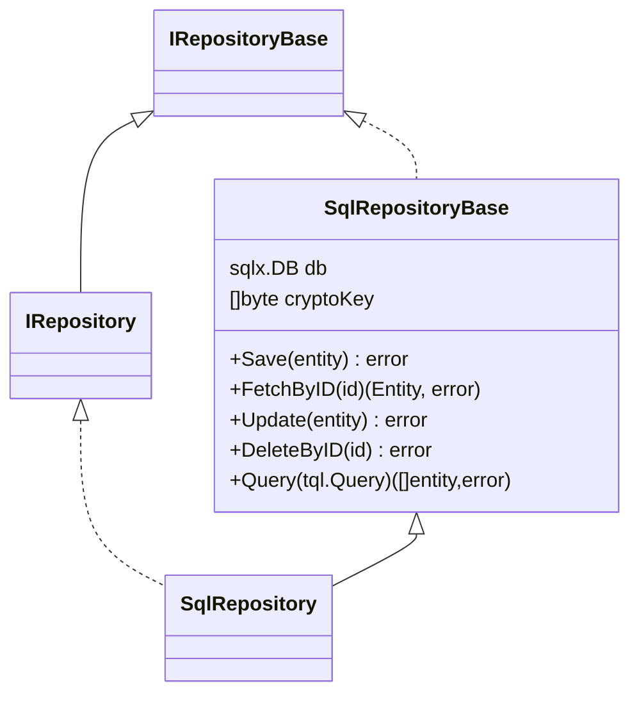

Using SQL as an output adapter in a hexagonal architecture involves interacting with a relational database to persist and retrieve domain entities. This adapter will translate domain objects into SQL-compatible data and vice versa, ensuring the core application's business logic remains independent of the database technology.

## Role of SQL as an Output Adapter

1. **Interfacing with SQL Databases**:
    - The adapter manages the interactions with the SQL database, executing queries to store and retrieve data.

2. **Data Translation**:
    - It converts domain objects into SQL queries and translates the result sets back into domain objects.

3. **Decoupling**:
    - It decouples the core application logic from SQL-specific implementation details, promoting flexibility and maintainability.


## Benefits of Using SQL as an Output Adapter

- **Data Integrity**: SQL databases provide strong consistency and integrity guarantees through ACID transactions.
- **Rich Querying**: SQL supports complex queries, joins, and aggregations, which can be powerful for data retrieval and manipulation.
- **Mature Ecosystem**: SQL databases have a mature ecosystem with extensive tools and libraries for database management, optimization, and scaling.
- **Decoupling**: The core application logic is decoupled from SQL-specific details, ensuring that business logic is independent of the data storage mechanism.

Using SQL as an output adapter in a hexagonal architecture provides a robust and flexible solution for data persistence. By implementing the repository pattern, the core application can remain agnostic to the specifics of the SQL database, promoting decoupling, flexibility, and maintainability. This approach ensures that the application can leverage the strengths of SQL databases while keeping the business logic clean and independent.

## Spec definition
The spec definition can be set via [$.spec.adapters.output.sql](basic_entity_definition.html#sql). An example of it could be:

???+ abstract "Output adapter Memory sample"
    ```yaml
    adapters:
      output:
        - type: sql
          metadata:
            table: "posts" #(1)!
    ```

    1. The `table` attribute let you configure the table name.

!!! info "Optional metadata"
    The metadata configuration is optional and if it has not been set defaults values will be used by Torpedo.
    For the table name, the entity name will be used to set it up.

## SQL Repository Implementation

The SQL Repository is coded on top of the poppular package [`github.com/jmoiron/sqlx`](https://github.com/jmoiron/sqlx). 
The class `sqlRepositoryBase` has implemented all the CRUD methods and also the Torpedo Query (TQL) method and the class
`SqlRepository`, which extends from `sqlRepositoryBase`, is where your repository logic should be placed. Also, the `*sqlx.DB` instance
will be available for developers.

!!! warning "Generation code"
    This adapter only creates Go code and is out of its scope managing any sql database, table creation or other management command.


The generated code should look like this:




### Data Mapper Object (DMO)

DMOs are the selected objects to map entity data into a secondary adapter or storage adapter.
These objects are responsible to encrypt or decrypt field values at save/update or fetch operations.

Each time that a repository is created the encryption key must be provided.

!!! warning "AES key"
    The key argument should be the AES key, either 16, 24, or 32 bytes to select AES-128, AES-192, or AES-256.

### Examples

The SQL repository has been tested with PostgrSQL, MariaDB/MySQL and SQLite drivers. 
Each entity needs to create their own repository instance and this happens into the entity `dependency` provider.

Before to `bind` a sql instance as part of your entity provider, a `sql.DB` provider must be created. 
The next ones are examples:

#### MySQL / MariaDB

??? abstract "dependency/mysql.go | MySQLProvider"
    ```go
    package dependency
    
    import (
        "database/sql"
        "fmt"
        "github.com/darksubmarine/torpedo-lib-go/app"
        "github.com/darksubmarine/torpedo-lib-go/conf"
        "github.com/darksubmarine/torpedo-lib-go/log"
    
        _ "github.com/go-sql-driver/mysql"
    )
    
    type MySQLProvider struct {
        app.BaseProvider
    
        // mysql singleton instance
        db *sql.DB `torpedo.di:"provide,name=MYSQL"` //(1)!
    
        // mysql driver name
        driverName string `torpedo.di:"provide,name=MYSQL_DRIVER_NAME"`//(2)!
    
        // logger instance to be provided
        logger log.ILogger `torpedo.di:"bind"`
    
        // private fields initialized by constructor
        cfg conf.Map
    }
    
    func NewMySQLProvider(config conf.Map) *MySQLProvider {
        return &MySQLProvider{cfg: config}
    }
    
    // Provide provides the logger instance.
    func (p *MySQLProvider) Provide(c app.IContainer) error {
    
        // the sql driver name
        p.driverName = "mysql"
    
        username := p.cfg.FetchStringOrElse("some-username", "db", "user")
        password := p.cfg.FetchStringOrElse("S3cret", "db", "password")
        host := p.cfg.FetchStringOrElse("127.0.0.1:3306", "db", "host")
        dbName := p.cfg.FetchStringOrElse("torpedo")
    
        // creating instance as singleton.
        if db, err := p.mysqlClient(username, password, host, dbName); err == nil {
            p.db = db
        } else {
            return err
        }
    
        return nil
    }
    
    func (p *MySQLProvider) OnStop() func() error {
        return func() error {
            return p.db.Close()
        }
    }
    
    func (p *MySQLProvider) mysqlClient(username, password, host, dbName string) (*sql.DB, error) {
        connStr := fmt.Sprintf("%s:%s@tcp(%s)/%s", username, password, host, dbName)
        ddb, err := sql.Open(p.driverName, connStr)
        if err != nil {
            return nil, err
        }
    
        err = ddb.Ping()
        if err != nil {
            return nil, err
        }
    
        return ddb, nil
    }
    
    ```

    1. This provides an instance of `*sql.DB` which can be bound setting the tag `torpedo.di:"bind,name=MYSQL"`
    2. This provides the required driver name which can be bound setting the tag `torpedo.di:"bind,name=MYSQL_DRIVER_NAME"`

#### PostgreSQL

??? abstract "dependency/postgresql.go | PostgreSQLProvider"
    ```go
    package dependency
    
    import (
        "database/sql"
        _ "github.com/lib/pq"
    
        "fmt"
        "github.com/darksubmarine/torpedo-lib-go/app"
        "github.com/darksubmarine/torpedo-lib-go/conf"
        "github.com/darksubmarine/torpedo-lib-go/log"
    )
    
    type PostgreSQLProvider struct {
        app.BaseProvider
    
        // postgres singleton instance
        db *sql.DB `torpedo.di:"provide,name=POSTGRES"` //(1)!
    
        // driver name
        driverName string `torpedo.di:"provide,name=POSTGRES_DRIVER_NAME"` //(2)!
    
        // logger instance to be provided
        logger log.ILogger `torpedo.di:"bind"`
    
        // private fields initialized by constructor
        cfg conf.Map
    }
    
    func NewPostgreSQLProvider(config conf.Map) *PostgreSQLProvider {
        return &PostgreSQLProvider{cfg: config}
    }
    
    // Provide provides the logger instance.
    func (p *PostgreSQLProvider) Provide(c app.IContainer) error {
    
        username := p.cfg.FetchStringOrElse("torpedo", "db", "username")
        password := p.cfg.FetchStringOrElse("S3cret", "db", "password")
        host := p.cfg.FetchStringOrElse("localhost:5432", "db", "host")
        dbName := p.cfg.FetchStringOrElse("torpedo", "db", "database")
    
        p.driverName = "postgres"
    
        if db, err := p.postgresClient(username, password, host, dbName); err == nil {
            p.db = db
        } else {
            return err
        }
    
        return nil
    }
    
    func (p *PostgreSQLProvider) OnStop() func() error {
        return func() error {
            return p.db.Close()
        }
    }
    
    func (p *PostgreSQLProvider) postgresClient(username, password, host, dbName string) (*sql.DB, error) {
        connStr := fmt.Sprintf("postgresql://%s:%s@%s/%s?sslmode=disable", username, password, host, dbName)
        // Connect to database
        ddb, err := sql.Open("postgres", connStr)
        if err != nil {
            return nil, err
        }
    
        err = ddb.Ping()
        if err != nil {
            return nil, err
        }
    
        return ddb, nil
    }
    ```

    1. This provides an instance of `*sql.DB` which can be bound setting the tag `torpedo.di:"bind,name=POSTGRES"`
    2. This provides the required driver name which can be bound setting the tag `torpedo.di:"bind,name=POSTGRES_DRIVER_NAME"`

#### SQLite

??? abstract "dependency/sqlite.go | SQLiteProvider"
    ```go
    package dependency
    
    import (
        "database/sql"
        _ "github.com/mattn/go-sqlite3"
    
        "github.com/darksubmarine/torpedo-lib-go/app"
        "github.com/darksubmarine/torpedo-lib-go/conf"
        "github.com/darksubmarine/torpedo-lib-go/log"
    )
    
    type SQLiteProvider struct {
        app.BaseProvider
    
        // sqlite singleton instance
        db *sql.DB `torpedo.di:"provide,name=SQLITE"` //(1)!
    
        // driver name
        driverName string `torpedo.di:"provide,name=SQLITE_DRIVER_NAME"` //(2)!
    
        // logger instance to be provided
        logger log.ILogger `torpedo.di:"bind"`
    
        // private fields initialized by constructor
        cfg conf.Map
    }
    
    func NewSQLiteProvider(config conf.Map) *SQLiteProvider {
        return &SQLiteProvider{cfg: config}
    }
    
    // Provide provides the logger instance.
    func (p *SQLiteProvider) Provide(c app.IContainer) error {
    
        dbName := p.cfg.FetchStringOrElse("torpedo.sqlite.db", "db", "database")
    
        p.driverName = "sqlite3"
    
        if db, err := p.sqliteClient(dbName); err == nil {
            p.db = db
        } else {
            return err
        }
    
        return nil
    }
    
    func (p *SQLiteProvider) OnStop() func() error {
        return func() error {
            return p.db.Close()
        }
    }
    
    func (p *SQLiteProvider) sqliteClient(dbName string) (*sql.DB, error) {
        // Connect to database
        ddb, err := sql.Open(p.driverName, dbName)
        if err != nil {
            return nil, err
        }
    
        err = ddb.Ping()
        if err != nil {
            return nil, err
        }
    
        return ddb, nil
    }
    ```

    1. This provides an instance of `*sql.DB` which can be bound setting the tag `torpedo.di:"bind,name=SQLITE"`
    2. This provides the required driver name which can be bound setting the tag `torpedo.di:"bind,name=SQLITE_DRIVER_NAME"`

#### Entity provider

Following the example of the section [Extending Entity with custom fields
](advanced_entity_add_fields.html#lets-following-this-with-an-example) we will need to bind a `sql` repository to the entity service like the example below:

??? abstract "dependency/sensor.go | SensorProvider"
    ```go
    package dependency
    
    import (
        "bitbucket.org/darksubmarine/machine/domain/entities/sensor"
        sensorHTTP "bitbucket.org/darksubmarine/machine/domain/entities/sensor/inputs/http/gin"
        sensorRepoSQL "bitbucket.org/darksubmarine/machine/domain/entities/sensor/outputs/sql"
        "database/sql"
        "github.com/darksubmarine/torpedo-lib-go/app"
        "github.com/darksubmarine/torpedo-lib-go/conf"
        "github.com/darksubmarine/torpedo-lib-go/log"
        "github.com/gin-gonic/gin"
    )
    
    type SensorProvider struct {
        app.BaseProvider
    
        // sensor service instance to be provided.
        service sensor.IService `torpedo.di:"provide"`
    
        // sensor repository instance to be provided.
        repo sensor.IRepository `torpedo.di:"provide"`
    
        // logger instance provided by LoggerProvider.
        logger log.ILogger `torpedo.di:"bind"`
    
        // storageKey is the crypto key to encode encrypted fields at storage level.
        storageKey []byte `torpedo.di:"bind,name=STORAGE_KEY"`
    
        // apiV1 group to register endpoints
        apiV1 *gin.RouterGroup `torpedo.di:"bind,name=APIv1"`
    
        dbSql      *sql.DB `torpedo.di:"bind,name=SQLITE"` //(1)!             // MYSQL POSTGRES SQLITE
        driverName string  `torpedo.di:"bind,name=SQLITE_DRIVER_NAME"` //(2)! //MYSQL_DRIVER_NAME POSTGRES_DRIVER_NAME SQLITE_DRIVER_NAME
    
        // private fields initialized by constructor
        cfg conf.Map
    }
    
    func NewSensorProvider(config conf.Map) *SensorProvider {
        return &SensorProvider{cfg: config}
    }
    
    // Provide provides instances.
    func (p *SensorProvider) Provide(c app.IContainer) error {
    
        // -- Repo (output) ---
        p.repo = sensorRepoSQL.NewSqlRepository(p.dbSql, p.driverName, p.storageKey)
        
        // -- Service (business logic)
        p.service = sensor.NewService(p.repo, p.logger)
    
        // -- Controller (input) --
        controller := sensorHTTP.NewInputGin(p.service, p.logger)
        controller.Register(p.apiV1)
    
        return nil
    }
    
    ```
    
    1. The sql instance is bound to the named instance: `SQLITE`
    2. The driver name is bound to the named driver: `SQLITE_DRIVER_NAME``
